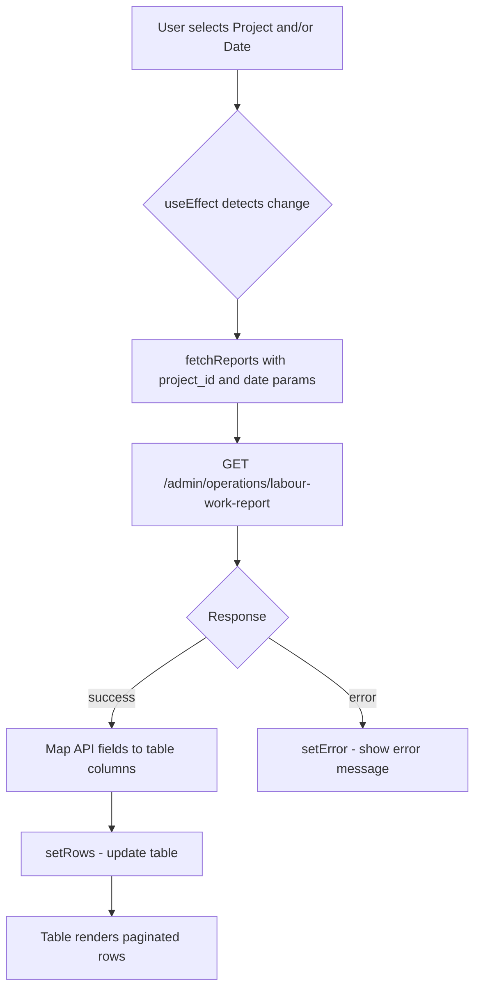

# Labour.jsx API Integration Plan

## Overview
Replace the current `/manager/labours/reports` endpoint and dummy data in [`src/pages/Labour.jsx`](src/pages/Labour.jsx) with the new `/admin/operations/labour-work-report` endpoint, wiring the existing **Project** and **Date** filters to the API.

---

## API Contract

| Item | Detail |
|------|--------|
| **Endpoint** | `GET /admin/operations/labour-work-report` |
| **Query Params** | `project_id` (optional), `date` (optional) |
| **Auth** | Bearer token (handled by shared axios instance) |

### Response Shape
```json
{
  "success": true,
  "data": [
    {
      "work_group_id": "string",
      "date": "string",
      "party": "string",
      "male_count": "string",
      "female_count": "string",
      "work_done": "string",
      "measurement": "string",
      "edit_reason": "string",
      "delete_reason": "string"
    }
  ]
}
```

### Field Mapping (API → Table)

| API Field | Table Column (`col.key`) |
|-----------|--------------------------|
| `work_group_id` | `id` |
| `date` | `date` |
| `party` | `party` |
| `male_count` | `m` |
| `female_count` | `f` |
| `work_done` | `workDone` |
| `measurement` | `measurements` |
| `edit_reason` | `reasonEdit` |
| `delete_reason` | `reasonDelete` |

---

## Changes Required

### 1. [`src/api/reportApi.js`](src/api/reportApi.js) — Add new API function

- Import the shared axios instance from [`axios.js`](src/api/axios.js) (currently `reportApi.js` creates its own instance — we'll switch to the shared one for consistency).
- Add `getLabourWorkReport(params)`:
  ```js
  import api from "./axios";

  export const getLabourWorkReport = (params) =>
    api.get("/admin/operations/labour-work-report", { params });
  ```
- Keep the existing `getReports` export for backward compatibility (it's used elsewhere).

### 2. [`src/pages/Labour.jsx`](src/pages/Labour.jsx) — Core integration

#### a. Imports
- Replace `import { getReports } from "../api/reportApi"` with `import { getLabourWorkReport } from "../api/reportApi"`

#### b. Remove dummy data
- Delete `labourDummyRows` array (lines 32–36)
- Delete `useDummyData` state (line 46)
- Remove the `filteredRows` fallback logic (line 139–142) — change to just use `rows` directly

#### c. Add loading & error states
```js
const [isLoading, setIsLoading] = useState(false);
const [error, setError] = useState(null);
```

#### d. Rewrite `fetchReports` to use new endpoint with filters
```js
const fetchReports = async (projectId, filterDate) => {
  setIsLoading(true);
  setError(null);
  try {
    const params = {};
    if (projectId) params.project_id = projectId;
    if (filterDate) params.date = filterDate;

    const res = await getLabourWorkReport(params);
    const data = res?.data?.data || [];

    const formatted = data.map((item) => ({
      id: item.work_group_id,
      date: item.date,
      party: item.party,
      m: item.male_count,
      f: item.female_count,
      workDone: item.work_done,
      measurements: item.measurement || "-",
      reasonEdit: item.edit_reason || "-",
      reasonDelete: item.delete_reason || "-",
    }));

    setRows(formatted);
  } catch (err) {
    console.error("Error fetching labour work reports:", err);
    setError("Failed to load labour data. Please try again.");
    setRows([]);
  } finally {
    setIsLoading(false);
  }
};
```

#### e. Trigger API on filter changes
- Replace the current `useEffect` (lines 114–118) with one that depends on `project` and `date`:
```js
useEffect(() => {
  fetchReports(project, date);
}, [project, date]);
```
- Remove the initial `fetchReports()` call from the old `useEffect`.

#### f. Add "All Projects" default option
- In the project `<select>`, prepend a default option:
```jsx
<option value="">All Projects</option>
```
- This ensures the user can clear the project filter.

#### g. Update `filteredRows` / `paginatedRows`
- Since dummy data is removed, `filteredRows` should just be `rows`:
```js
const filteredRows = rows;
```
- Or simply use `rows` directly in `paginatedRows` and remove `filteredRows`.

#### h. Add loading/error UI indicators
- Show a loading spinner or "Loading..." text when `isLoading` is true.
- Show error message when `error` is set.
- Show "No rows found" when `rows` is empty and not loading.

---

## Data Flow Diagram



---

## Files to Modify

| File | Change |
|------|--------|
| [`src/api/reportApi.js`](src/api/reportApi.js) | Add `getLabourWorkReport` using shared axios instance |
| [`src/pages/Labour.jsx`](src/pages/Labour.jsx) | Wire filters to API, update field mapping, remove dummy data, add loading/error states |

---

## Edge Cases Covered

1. **No filters selected** — API called without params, returns all records
2. **Only project selected** — `?project_id=4`
3. **Only date selected** — `?date=2026-05-14`
4. **Both selected** — `?project_id=4&date=2026-05-14`
5. **API error** — Error message displayed, table shows "No rows found"
6. **Empty response** — Table shows "No rows found"
7. **Missing optional fields** (`measurement`, `edit_reason`, `delete_reason`) — Fallback to `"-"`